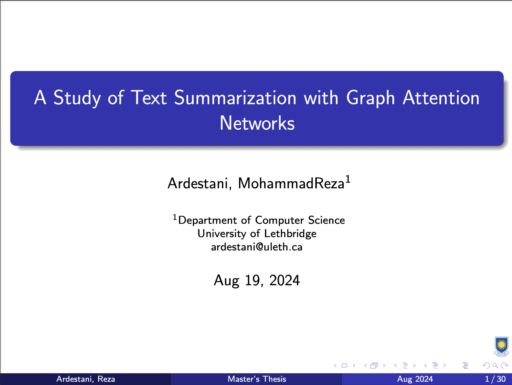

# thesis_examination_slides
Hello, fellow Computer Science graduate students! I'd like to share my thesis examination slides with you, in the hope that they save you some time.

## My prepretaion
The most frequent feedback I received after my presentation was, "Why were you so calm?" or "You presented as if it wasn't a stressful defense." How did I achieve that uncanny calmness? Well, through practice! There was no magic. Before the defense, I asked Hasib, Sajad, Amir, Arnad, and Mohsin for feedback, and they kindly provided me with many insightful suggestions.

## First four slides of my presentation
<figure>
    
</figure>
<figure>
    
</figure>
<figure>
    
</figure>
<figure>
    
</figure>
 
 

## Pen and Paper!
